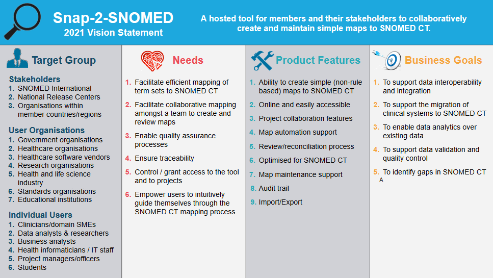

<!-- PROJECT LOGO -->
<br />
<p align="center">
  <a href="https://github.com/IHTSDO/snap2snomed">
    
  </a>

  <p align="center">
    A tool for creating and maintaining simple maps to SNOMED CT
  </p>
</p>

## About The Project
This project is a mapping tool designed to allow users to collaboratively create and maintain simple maps to FHIR CodeSystems.

It is a fork from Snap2Snomed for which the following is the current vision of that project


### Built With

* [Angular](https://angular.io/)
* [Spring Boot](https://spring.io/projects/spring-boot)
* [Maven](https://maven.apache.org/)
* [FHIR Terminology Module](https://www.hl7.org/fhir/terminology-module.html)

## Getting Started

To get a local copy up and running follow these simple steps.

### Prerequisites

This is an example of how to list things you need to use the software and how to install them.
* Maven - refer to [Maven's installation instructions](https://maven.apache.org/download.cgi)

### Installation

1. Clone the repo
   ```sh
   git clone https://github.com/aehrc/snap2snomed.git
   ```
2. Run the Maven build
   ```sh
   mvn clean package
   ```


<!-- CONTRIBUTING -->
## Contributing

Contributions are what make the open source community such an amazing place to be learn, inspire, and create. Any contributions you make are **greatly appreciated**.

1. Fork the Project
2. Create your Feature Branch (`git checkout -b feature/AmazingFeature`)
3. Commit your Changes (`git commit -m 'Add some AmazingFeature'`)
4. Push to the Branch (`git push origin feature/AmazingFeature`)
5. Open a Pull Request

This project uses the [Google Java Style Guide](https://google.github.io/styleguide/javaguide.html), please stick to this style to avoid unnecessary churn in the codebase. You can get style formatters for [Eclipse](https://github.com/google/styleguide/blob/gh-pages/eclipse-java-google-style.xml) and [IntelliJ](https://github.com/google/styleguide/blob/gh-pages/intellij-java-google-style.xml).

<!-- LICENSE -->
## License

Distributed under the Apache 2.0 License. See `LICENSE` for more information.


<!-- CONTACT -->
## Contact

Project Link: [https://github.com/IHTSDO/snap2snomed](https://github.com/IHTSDO/snap2snomed)


<!-- ACKNOWLEDGEMENTS -->
## Acknowledgements

* [SNOMED International](https://www.snomed.org/)
